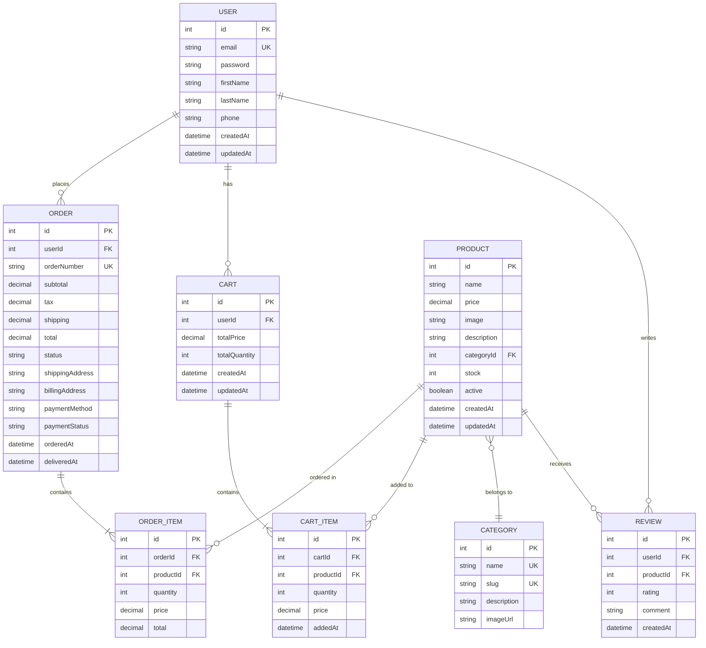

# 🛍️ E-Commerce Web Application

A modern, feature-rich e-commerce platform built with Next.js 16, TypeScript, Redux Toolkit, and Tailwind CSS. This application provides a seamless shopping experience with real-time cart management, dark mode support, and responsive design.


## 📋 Table of Contents

- [Features](#-features)
- [System Architecture](#-system-architecture)
- [Database Schema (ER Diagram)](#-database-schema-er-diagram)
- [Tech Stack](#-tech-stack)
- [Getting Started](#-getting-started)
- [Project Structure](#-project-structure)
- [State Management](#-state-management)
- [Component Architecture](#-component-architecture)
- [API Routes](#-api-routes)
- [Contributing](#-contributing)
- [License](#-license)

---

## ✨ Features

### 🛒 **Shopping Cart Management**

- **Add to Cart**: Seamlessly add products to your cart with real-time updates
- **Quantity Control**: Increment/decrement product quantities directly from the cart
- **Remove Items**: Quick removal of unwanted items from the cart
- **Cart Drawer**: Slide-out cart panel for quick checkout overview
- **Persistent Cart**: Cart state persists across sessions using Redux Persist
- **Cart Summary**: Real-time calculation of subtotal, tax, and total amount

### 📦 **Product Catalog**

- **Product Grid**: Responsive grid layout showcasing all available products
- **Product Cards**: Rich product cards with images, descriptions, and pricing
- **Category Filtering**: Browse products by categories (Electronics, Fashion, Home & Living)
- **Product Details**: Comprehensive product information with high-quality images

### 🎨 **User Interface**

- **Dark Mode**: System-aware theme with manual toggle support
- **Responsive Design**: Fully responsive layout optimized for mobile, tablet, and desktop
- **Modern UI**: Clean, minimalist design with smooth animations and transitions
- **Accessibility**: WCAG-compliant with keyboard navigation and screen reader support

### 🔧 **Technical Features**

- **Redux State Management**: Centralized state management with Redux Toolkit
- **Server-Side Rendering (SSR)**: Optimized SEO and initial page load performance
- **TypeScript**: Type-safe codebase reducing runtime errors
- **Code Splitting**: Automatic code splitting for optimal bundle sizes
- **Performance Optimization**: Image optimization, lazy loading, and caching strategies

### 🚀 **Order Management**

- **Order Summary**: Review order details before checkout
- **Order History**: Track past orders and their status (planned feature)
- **Checkout Flow**: Streamlined checkout process with validation

---

## 🏗️ System Architecture

```
┌─────────────────────────────────────────────────────────────┐
│                         Client Layer                         │
│  ┌──────────────┐  ┌──────────────┐  ┌──────────────┐      │
│  │   Navbar     │  │ ThemeToggle  │  │  CartDrawer  │      │
│  └──────────────┘  └──────────────┘  └──────────────┘      │
│  ┌──────────────────────────────────────────────────┐      │
│  │            Next.js App Router (RSC)              │      │
│  │  ┌────────────┐  ┌────────────┐  ┌────────────┐ │      │
│  │  │  Home Page │  │ Categories │  │  Products  │ │      │
│  │  └────────────┘  └────────────┘  └────────────┘ │      │
│  └──────────────────────────────────────────────────┘      │
└─────────────────────────────────────────────────────────────┘
                              ▼
┌─────────────────────────────────────────────────────────────┐
│                    State Management Layer                    │
│  ┌──────────────────────────────────────────────────────┐  │
│  │              Redux Toolkit Store                     │  │
│  │  ┌─────────────────┐  ┌──────────────────┐         │  │
│  │  │  Cart Slice     │  │  Order Slice     │         │  │
│  │  │  - items[]      │  │  - orderDetails  │         │  │
│  │  │  - totalQty     │  │  - status        │         │  │
│  │  │  - totalPrice   │  │  - shipping      │         │  │
│  │  └─────────────────┘  └──────────────────┘         │  │
│  └──────────────────────────────────────────────────────┘  │
│  ┌──────────────────────────────────────────────────────┐  │
│  │            Redux Persist (LocalStorage)              │  │
│  └──────────────────────────────────────────────────────┘  │
└─────────────────────────────────────────────────────────────┘
                              ▼
┌─────────────────────────────────────────────────────────────┐
│                      Data Layer                              │
│  ┌──────────────────────────────────────────────────────┐  │
│  │              Static Product Data (lib/data.ts)       │  │
│  │  • Product Interface                                 │  │
│  │  • Product Catalog (12 products)                     │  │
│  │  • Category Grouping Utilities                       │  │
│  └──────────────────────────────────────────────────────┘  │
│  ┌──────────────────────────────────────────────────────┐  │
│  │         Future:  API Integration Layer                │  │
│  │  • REST API / GraphQL                                │  │
│  │  • Authentication Service                            │  │
│  │  • Payment Gateway Integration                       │  │
│  └──────────────────────────────────────────────────────┘  │
└─────────────────────────────────────────────────────────────┘
```

### Architecture Flow:

1. **Client Layer**: React components render the UI and handle user interactions
2. **State Management Layer**: Redux Toolkit manages global state with persistence
3. **Data Layer**: Provides product data and handles external API communication
4. **Rendering Strategy**:
   - Server Components for static content (RSC)
   - Client Components for interactive features
   - Hybrid rendering for optimal performance

---

## 🗄️ Database Schema (ER Diagram)



### Schema Description:

#### **Core Entities**

- **USER**: Stores customer information and authentication credentials
- **PRODUCT**: Contains product details, pricing, and inventory
- **CATEGORY**: Organizes products into logical groups
- **CART**: Temporary storage for products before checkout
- **ORDER**: Finalized purchase records with payment and shipping details
- **REVIEW**: Customer feedback and ratings for products

#### **Relationships**

- One user can have multiple orders and one active cart
- Products belong to categories and can appear in multiple orders/carts
- Orders contain multiple order items, each linked to a product
- Users can write multiple reviews for different products

---

## 🛠️ Tech Stack

### **Frontend**

- **Next.js 16.1** - React framework with App Router
- **React 19.2** - UI library
- **TypeScript 5.x** - Type safety
- **Tailwind CSS 4.x** - Utility-first CSS framework
- **next-themes** - Dark mode implementation

### **State Management**

- **Redux Toolkit 2.11** - State management
- **React Redux 9.2** - React bindings for Redux
- **Redux Persist 6.0** - State persistence

### **Development Tools**

- **ESLint 9.x** - Code linting
- **PostCSS** - CSS transformations
- **TypeScript ESLint** - TypeScript linting rules

### **Deployment**

- **Vercel** - Hosting platform (recommended)
- **GitHub Actions** - CI/CD pipeline (optional)

---

## 🚀 Getting Started

### Prerequisites

- Node.js 20.x or higher
- npm, yarn, pnpm, or bun package manager
- Git

### Installation

1. **Clone the repository**

   ```bash
   git clone https://github.com/MamunCrafts/ecommerce-web-application.git
   cd ecommerce-web-application
   ```

2. **Install dependencies**

   ```bash
   npm install
   # or
   yarn install
   # or
   pnpm install
   # or
   bun install
   ```

3. **Set up environment variables**
   Create a `.env.local` file in the root directory:

   ```env
   # Application
   NEXT_PUBLIC_APP_URL=http://localhost:3000

   # Future: Database
   # DATABASE_URL=your_database_url

   # Future: Authentication
   # NEXTAUTH_SECRET=your_secret_key
   # NEXTAUTH_URL=http://localhost:3000

   # Future: Payment Gateway
   # STRIPE_SECRET_KEY=your_stripe_key
   # NEXT_PUBLIC_STRIPE_PUBLISHABLE_KEY=your_stripe_publishable_key
   ```

4. **Run the development server**

   ```bash
   npm run dev
   # or
   yarn dev
   # or
   pnpm dev
   # or
   bun dev
   ```

5. **Open your browser**
   Navigate to [http://localhost:3000](http://localhost:3000)

### Building for Production

```bash
# Create optimized production build
npm run build

# Start production server
npm run start
```

---

## 📁 Project Structure

```
ecommerce-web-application/
├── app/                          # Next.js App Router
│   ├── layout.tsx               # Root layout with providers
│   ├── page. tsx                 # Home page
│   ├── globals.css              # Global styles
│   └── favicon.ico              # Site favicon
│
├── components/                   # Reusable React components
│   ├── Navbar.tsx               # Main navigation bar
│   ├── Footer.tsx               # Site footer
│   ├── CartDrawer.tsx           # Shopping cart sidebar
│   ├── CartItem.tsx             # Individual cart item
│   ├── ProductCard.tsx          # Product display card
│   ├── CategorySection.tsx      # Category filter section
│   ├── ThemeToggle.tsx          # Dark/light mode toggle
│   └── Providers.tsx            # Redux & Theme providers
│
├── lib/                          # Library code and utilities
│   ├── features/                # Redux features
│   │   └── cart/
│   │       ├── cartSlice.ts     # Cart state management
│   │       └── orderSlice.ts    # Order state management
│   ├── store. ts                 # Redux store configuration
│   ├── hooks.ts                 # Custom React hooks
│   └── data.ts                  # Static product data
│
├── public/                       # Static assets
│   └── images/                  # Image assets
│
├── . gitignore                   # Git ignore rules
├── eslint.config.mjs            # ESLint configuration
├── next.config.ts               # Next.js configuration
├── package.json                 # Dependencies and scripts
├── postcss.config.mjs           # PostCSS configuration
├── tailwind.config.ts           # Tailwind CSS configuration
├── tsconfig.json                # TypeScript configuration
└── README.md                    # Project documentation
```

---

## 🔄 State Management

### Redux Store Structure

```typescript
{
  cart: {
    items: CartItem[],
    totalQuantity: number,
    totalPrice: number
  },
  order: {
    orderDetails: OrderDetails | null,
    status: 'idle' | 'pending' | 'completed' | 'failed'
  }
}
```

### Cart Slice Actions

- `addToCart(product)` - Add product to cart or increment quantity
- `removeFromCart(productId)` - Remove product from cart
- `incrementQuantity(productId)` - Increase product quantity
- `decrementQuantity(productId)` - Decrease product quantity
- `clearCart()` - Empty the entire cart

### Redux Persist Configuration

Cart state is automatically persisted to `localStorage` and rehydrated on app load:

```typescript
const persistConfig = {
  key: "root",
  storage,
  whitelist: ["cart"], // Only persist cart state
};
```

---

## 🧩 Component Architecture

### Component Hierarchy

```
App
├── Providers (Redux, Theme)
│   ├── Navbar
│   │   ├── ThemeToggle
│   │   └── CartButton (opens CartDrawer)
│   │
│   ├── HomePage
│   │   ├── HeroSection
│   │   ├── CategorySection
│   │   └── ProductGrid
│   │       └── ProductCard (x12)
│   │
│   ├── CartDrawer
│   │   ├── CartItem (xN)
│   │   ├── CartSummary
│   │   └── CheckoutButton
│   │
│   └── Footer
```

### Key Components

#### **Navbar. tsx**

- Responsive navigation with mobile menu
- Cart icon with item count badge
- Theme toggle integration
- Logo and branding

#### **ProductCard.tsx**

- Product image with fallback
- Product name, price, and description
- "Add to Cart" button with loading state
- Hover effects and animations

#### **CartDrawer.tsx**

- Slide-in drawer from right side
- Cart item list with scrolling
- Order summary (subtotal, tax, total)
- Empty cart state
- Checkout button

#### **CartItem.tsx**

- Product thumbnail
- Quantity controls (+/-)
- Remove button
- Price calculation

---

## 🌐 API Routes

### Current Implementation

The application currently uses static data from `lib/data.ts`.

### Future API Endpoints

```
/api/products
├── GET    /                    # Get all products
├── GET    /:id                 # Get product by ID
├── GET    /category/:category  # Get products by category
└── POST   /                    # Create new product (Admin)

/api/cart
├── GET    /                    # Get user's cart
├── POST   /                    # Add item to cart
├── PUT    /:itemId             # Update cart item
└── DELETE /:itemId             # Remove from cart

/api/orders
├── GET    /                    # Get user's orders
├── POST   /                    # Create new order
└── GET    /:orderId            # Get order details

/api/auth
├── POST   /register            # User registration
├── POST   /login               # User login
└── POST   /logout              # User logout

/api/categories
└── GET    /                    # Get all categories
```

---

## 🎯 Planned Features

### Phase 2: Authentication & User Management

- [ ] User registration and login
- [ ] OAuth integration (Google, GitHub)
- [ ] User profile management
- [ ] Order history

### Phase 3: Backend Integration

- [ ] Database integration (PostgreSQL/MongoDB)
- [ ] RESTful API development
- [ ] Product CRUD operations
- [ ] Inventory management

### Phase 4: Payment Integration

- [ ] Stripe payment gateway
- [ ] Multiple payment methods
- [ ] Order confirmation emails
- [ ] Invoice generation

### Phase 5: Advanced Features

- [ ] Product search and filtering
- [ ] Product reviews and ratings
- [ ] Wishlist functionality
- [ ] Product recommendations
- [ ] Admin dashboard
- [ ] Analytics integration

### Phase 6: Performance & SEO

- [ ] Image CDN integration
- [ ] Advanced caching strategies
- [ ] SEO optimization
- [ ] PWA capabilities
- [ ] Performance monitoring

---

## 🧪 Testing

```bash
# Run unit tests (future)
npm run test

# Run E2E tests (future)
npm run test:e2e

# Run tests with coverage (future)
npm run test:coverage
```

---

## 📈 Performance Optimization

- **Code Splitting**: Automatic route-based code splitting
- **Image Optimization**: Next.js Image component with lazy loading
- **Font Optimization**: Self-hosted fonts with `next/font`
- **Bundle Analysis**: Analyze bundle size with `@next/bundle-analyzer`
- **Caching**: Aggressive caching of static assets
- **Minification**: Production builds are automatically minified

---

## 🤝 Contributing

Contributions are welcome! Please follow these steps:

1. Fork the repository
2. Create a feature branch (`git checkout -b feature/AmazingFeature`)
3. Commit your changes (`git commit -m 'Add some AmazingFeature'`)
4. Push to the branch (`git push origin feature/AmazingFeature`)
5. Open a Pull Request

### Code Style Guidelines

- Follow TypeScript best practices
- Use meaningful variable and function names
- Write clear comments for complex logic
- Maintain consistent formatting (Prettier)
- Follow React best practices and hooks rules

---

## 📄 License

This project is licensed under the MIT License - see the [LICENSE](LICENSE) file for details.

---

## 👨‍💻 Author

**Mamun**

- GitHub: [@MamunCrafts](https://github.com/MamunCrafts)

---

## 🙏 Acknowledgments

- [Next.js](https://nextjs.org/) - React Framework
- [Tailwind CSS](https://tailwindcss.com/) - CSS Framework
- [Redux Toolkit](https://redux-toolkit.js.org/) - State Management
- [Unsplash](https://unsplash.com/) - Product Images
- [Vercel](https://vercel.com/) - Deployment Platform

---

## 📞 Support

If you have any questions or need help, please open an issue in the GitHub repository or contact the maintainer.

---

<div align="center">
  <p>Made with ❤️ by MamunCrafts</p>
  <p>⭐ Star this repository if you find it helpful!</p>
</div>
